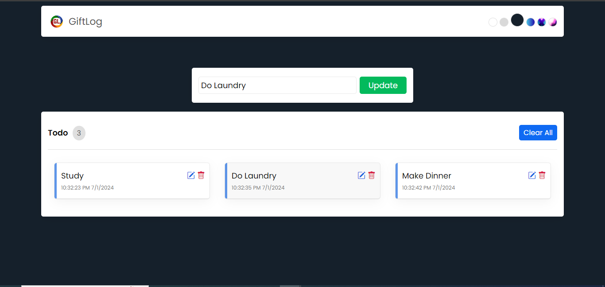

# GiftLog

A simple task manager application built with React, allowing users to add, edit, and delete tasks. The application also includes theme selection and persists data using local storage.

## Features

- Add new tasks
- Edit existing tasks
- Delete tasks
- Clear all tasks
- Theme selection (light, medium, dark, and gradient themes)
- Persistent data storage using local storage

## Screenshots



## Getting Started

### Prerequisites

- Node.js
- npm or yarn

### Installation

1. Clone the repository:
    ```bash
    git clone https://github.com/your-username/task-manager.git
    ```

2. Navigate to the project directory:
    ```bash
    cd GiftLog
    ```

3. Install the dependencies:
    ```bash
    npm install
    ```
    or
    ```bash
    yarn install
    ```

### Running the Application

1. Start the development server:
    ```bash
    npm start
    ```
    or
    ```bash
    yarn start
    ```

2. Open your browser and visit:
    ```
    http://localhost:3000
    ```

## Deployment

The application is deployed at: [GiftLog Deployment](https://gift-log.vercel.app/)

## Code Structure

- `src/`
  - `components/`
    - `Header.js` - Handles the header and theme selection
    - `AddTask.js` - Form for adding and editing tasks
    - `ShowTask.js` - Displays the list of tasks
  - `App.js` - Main application component
  - `App.css` - Styling for the application

## Local Storage

- Tasks are saved to local storage under the key `tasklist`.
- Selected theme is saved to local storage under the key `theme`.

## License

This project is licensed under the MIT License. See the [LICENSE](LICENSE) file for details.

## Acknowledgments

- [React](https://reactjs.org/)
- [Create React App](https://github.com/facebook/create-react-app)
- React JS Masterclass - Go From Zero To Job Ready by Shubham Sarda
